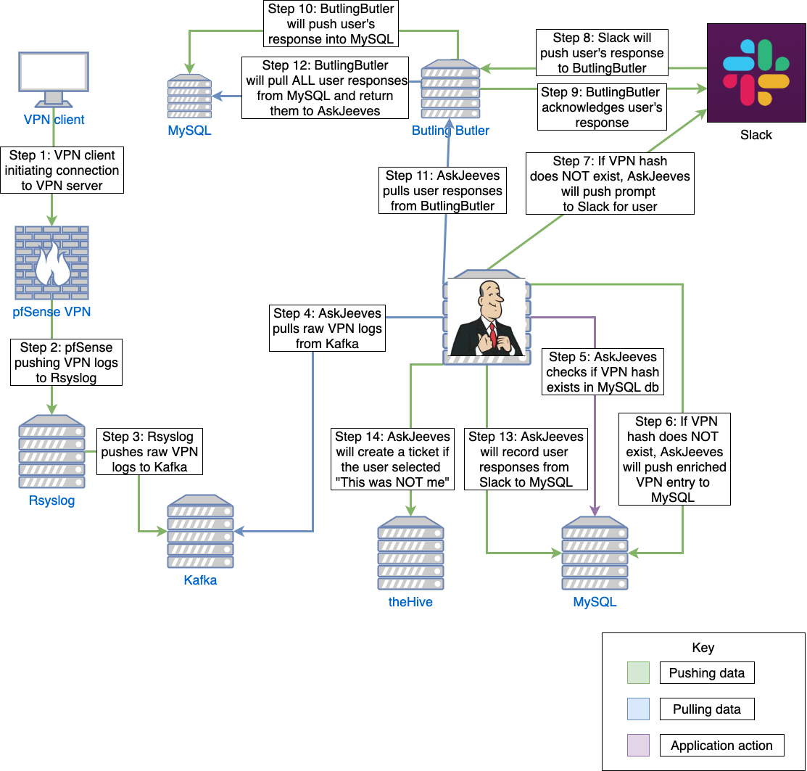

# AskJeevesSecBot

AskJeevesSecBot is golang project that has a rule engine that triggers Slack notifications to users based on pre-defined conditions. For example, a user is located in the US but suddenly there is a VPN login from Russia. This project will will send a Slack notification to the user asking if that was them, if so nothing happens, if not an incident response ticket is generated.

* [Blog post here](https://holdmybeersecurity.com/2020/04/08/reducing-your-alert-fatigue-with-askjeevesseecbot/)

## User prompt

## User accept

## User denied

## Diagram

  

## System requirements
* CPU: 2 cores
* Memory: 1.5GBs
* HDD: 5GBs

## References
### Rsyslog
* [Rsyslog Expressions](https://www.rsyslog.com/doc/v8-stable/rainerscript/expressions.html)
* [Rsyslog field()](https://www.rsyslog.com/doc/v8-stable/rainerscript/functions/rs-field.html)
* [23.8. STRUCTURED LOGGING WITH RSYSLOG](https://access.redhat.com/documentation/en-us/red_hat_enterprise_linux/7/html/system_administrators_guide/s1-structured_logging_with_rsyslog)
* [Index JSON Messages over Syslog](https://sematext.com/docs/logs/json-messages-over-syslog/)
* 
* 
* 

### Golang
* [Format a Go string without printing?](https://stackoverflow.com/questions/11123865/format-a-go-string-without-printing)
* [Go by Example: SHA1 Hashes](https://gobyexample.com/sha1-hashes)
* [Package md5](https://golang.org/pkg/crypto/md5/)
* [Using Go Modules](https://blog.golang.org/using-go-modules)
* [Slack API in Go](https://github.com/slack-go/slack)
* [Marshal and unMarshal of Struct to JSON in Golang](https://www.restapiexample.com/golang-tutorial/marshal-and-unmarshal-of-struct-data-using-golang/)
* [Assigning null to JSON fields instead of empty strings](https://stackoverflow.com/questions/31048557/assigning-null-to-json-fields-instead-of-empty-strings)
* [How convert a string into json or a struct?](https://forum.golangbridge.org/t/how-convert-a-string-into-json-or-a-struct/3457)
* [Kafka Go Client](https://docs.confluent.io/current/clients/go.html)
* [package maxminddb](https://pkg.go.dev/github.com/oschwald/maxminddb-golang?tab=doc#example-Reader.Lookup-Interface)
* [md5-example.go](https://gist.github.com/sergiotapia/8263278)
* [Sleeping in Go – How to Pause Execution](https://golangcode.com/sleeping-with-go/)
* [How to Parse JSON in Golang (With Examples)](https://www.sohamkamani.com/blog/2017/10/18/parsing-json-in-golang/)
* [package sha3](https://pkg.go.dev/golang.org/x/crypto/sha3?tab=overview)
* [Using The Log Package In Go](https://www.ardanlabs.com/blog/2013/11/using-log-package-in-go.html)
* [goCron: A Golang Job Scheduling Package.](https://github.com/jasonlvhit/gocron)
* [Save an image from url to file](https://stackoverflow.com/questions/22417283/save-an-image-from-url-to-file)
* [Package http](https://golang.org/pkg/net/http/)
* [How to Format Current Date & Time in Golang](https://www.utekar.com/golang-current-date-time-format/)
* [Format a time or date [complete guide]](https://yourbasic.org/golang/format-parse-string-time-date-example/)
* [How to URL Encode a String in Golang](https://www.urlencoder.io/golang/)
* [Generating good unique ids in Go edit](https://blog.kowalczyk.info/article/JyRZ/generating-good-unique-ids-in-go.html)
* [How to multiply duration by integer?](https://stackoverflow.com/questions/17573190/how-to-multiply-duration-by-integer)
* [Get current date and time in various format in golang](https://www.golangprograms.com/get-current-date-and-time-in-various-format-in-golang.html)
* [Go Tickers Tutorial](https://tutorialedge.net/golang/go-ticker-tutorial/)
* [Go and JSON](https://eager.io/blog/go-and-json/)
* [Golang basics - fetch JSON from an API](https://blog.alexellis.io/golang-json-api-client/)
* [Golang: Making HTTP Requests](http://polyglot.ninja/golang-making-http-requests/)
* [io.Reader in depth](https://medium.com/@matryer/golang-advent-calendar-day-seventeen-io-reader-in-depth-6f744bb4320b)
* [How to Tar and Un-tar Files in Golang](https://medium.com/@skdomino/taring-untaring-files-in-go-6b07cf56bc07)
* [Golang: Working with Gzip and Tar](http://blog.ralch.com/tutorial/golang-working-with-tar-and-gzip/)
* [Unzip Files in Go](https://golangcode.com/unzip-files-in-go/)
* [Golang Read Write Create and Delete text file](https://www.golangprograms.com/golang-read-write-create-and-delete-text-file.html)
* [GET JSON array in Golang](https://gist.github.com/montanaflynn/b390b1212dada5864d9b)
* [json_to_map.go](https://gist.github.com/cuixin/f10cea0f8639454acdfbc0c9cdced764)
* 
* 
* 

### GeoIP
* [IP to City Lite database](https://db-ip.com/db/download/ip-to-city-lite)
* [Automatic Updates for GeoIP2 and GeoIP Legacy Databases](https://dev.maxmind.com/geoip/geoipupdate/)
* [Part 1) Download a File (from a URL)](https://golangcode.com/download-a-file-from-a-url/)
* 
* 
* 
* 

### MySQL 
* [Golang MySQL Tutorial](https://tutorialedge.net/golang/golang-mysql-tutorial/)
* [Connecting to database](http://gorm.io/docs/connecting_to_the_database.html)
* [Host '172.18.0.1' is not allowed to connect to this MySQL server](https://github.com/docker-library/mysql/issues/275)
* [Advanced Usage](http://jinzhu.me/gorm/advanced.html#compose-primary-key)
* [Developing a simple CRUD API with Go, Gin and Gorm](https://medium.com/@cgrant/developing-a-simple-crud-api-with-go-gin-and-gorm-df87d98e6ed1)
* [GORM - Delete](http://gorm.io/docs/delete.html)
* [GORM - Query](http://gorm.io/docs/query.html)
* [Update All Fields](https://jinzhu.me/gorm/crud.html#query)
* [Building RESTful APIs in Golang](https://martinheinz.dev/blog/8)
* 
* 
* 

### Google Maps
* [Golang : Convert []byte to image](https://www.socketloop.com/tutorials/golang-convert-byte-to-image)
* [Maps Static API Usage and Billing](https://developers.google.com/maps/documentation/maps-static/usage-and-billing?hl=en_US)
* [Get Started with Google Maps Platform](https://developers.google.com/maps/gmp-get-started)
* [Get an API Key](https://developers.google.com/places/web-service/get-api-key)
* [Pulling Google’s location image from Places API](https://forum.bubble.io/t/pulling-googles-location-image-from-places-api/1549)
* [Python | Get a google map image of specified location using Google Static Maps API](https://tutorialspoint.dev/language/python/python-get-google-map-image-specified-location-using-google-static-maps-api)
* 
* 
* 
* 

### Kafka
* [KSQL Problem while - print <topic> from beginning #2386](https://github.com/confluentinc/ksql/issues/2386)
* 
* 
* 

### Slack
* [slack-go/slack - channels.go](https://github.com/slack-go/slack/blob/master/channels.go)
* [Github issue 604 - failed to post message with SectionBlock: invalid_blocks](https://github.com/slack-go/slack/issues/603)
* [nlopes/slack - Sourccegraph](https://sourcegraph.com/github.com/nlopes/slack@7c3a24ccf8f5053022381bde95e29cf882700285/-/blob/block.go#L61)
* [package slack](https://pkg.go.dev/github.com/slack-go/slack?tab=doc#AttachmentAction)
* 
* 
* 

### Heroku
* 
* 
* 
* 
* 
* 
* 
* 
* 
