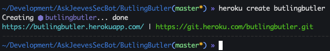
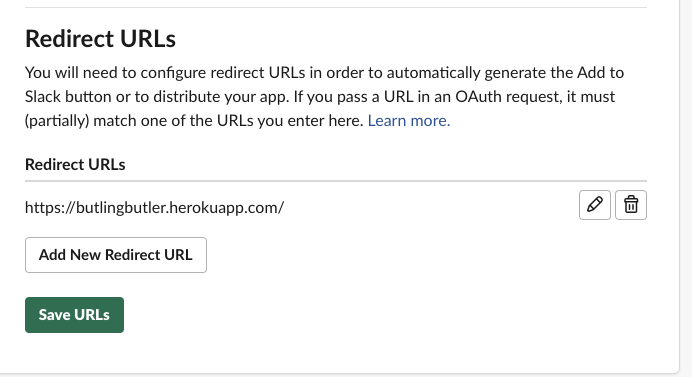
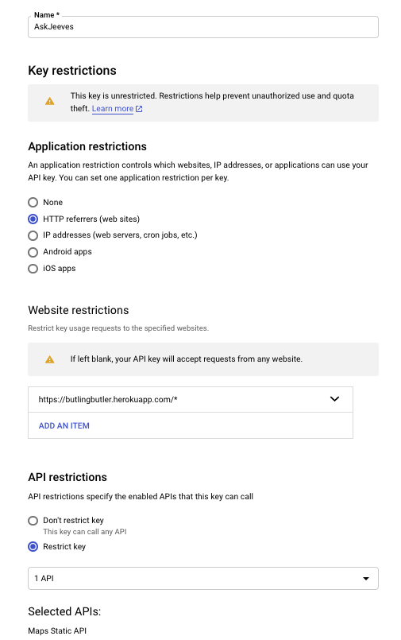
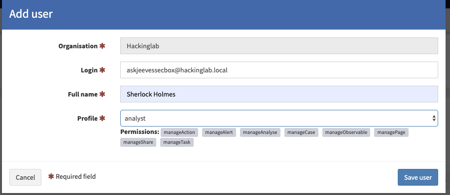
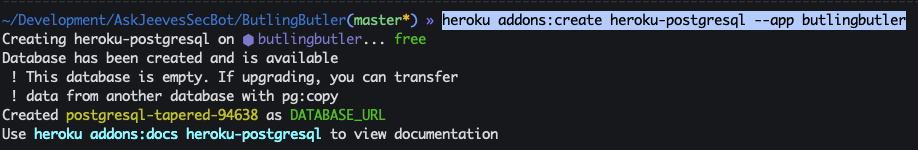
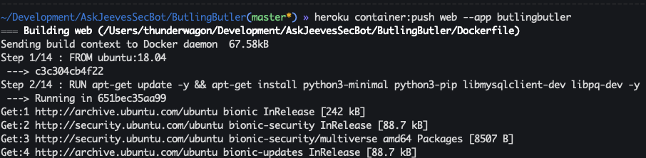
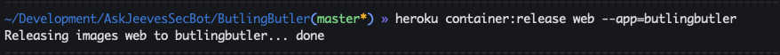
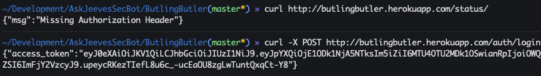
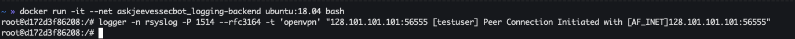
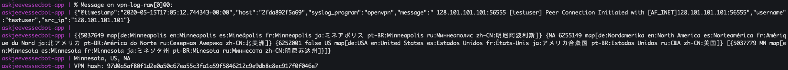

# Install/Setup AskJeevesSecBot

## Init config files
1. `git clone https://github.com/CptOfEvilMinions/AskJeevesSecBot`
1. `cd AskJeevesSecBot`
1. `mv AskJeeves/config/config.yaml.example AskJeeves/config/config.yaml`
1. `mv ButlingButler/config/config.py.example ButlingButler/config/config.py`

## Create MaxMind license key for GeoIP database
1. Go to [GeoIP](https://www.maxmind.com/en/geoip-demo) and login
1. Select "My License Key" on the left under "Services"
1. Select "Generate new license key"
    1. Enter `AskJeevesSecBot` into "License key description"
    1. Select "No" for if this will be used GeoIP update
    1. Select "Confirm"
1. Copy "License key"
1. `sed -i 's/max_mind_license_key_here/<LICENSE KEY>/g' AskJeeves/config/config.yaml`

### Init Heroku
1. `brew tap heroku/brew && brew install heroku`
1. `heroku autocomplete`
1. `printf "$(heroku autocomplete:script zsh)" >> ~/.zshrc; source ~/.zshrc`
1. `heroku plugins:install @heroku-cli/plugin-manifest`

### Create Heroku app
1. `cd AskJeevesSecBot/ButlingButler`
1. `heroku create butlingbutler`
1. 
1. Copy the URL provided above
1. `sed -i 's/butling_butler_url/<BURLING BUTLER URL from Heroku>/g ../AskJeeves/config/config.yaml`
1. `heroku config:set ON_HEROKU=1`

## Create and configure Slack app
### Create app
1. Login into Slack with administrator account
1. Select "Your Apps" in the top right
1. Select "Create New App"
    1. Enter `AskJeevesSecBot` into "App Name"
    1. Select `<YOUR SLACK workspace>`
    1. Select "Create app"
    1. 

### Set Redirect URL
1. Select "Permissions" under "Add features and functionality"
1. Select "Add New Redirect URL"
1. Enter URL from Heroku above
1. 
1. Select "Save URLs"

### Add permissions
1. Add the following permissions to "Scopes" 
    * `chat:write` - Send messages as @askjeevessecbot
    * `im:read` - View basic information about direct messages that AskJeevesSecBot has been added to
    * `im:write` - Start direct messages with people
    1. 
1. Scroll up to the top and select "Install app to Workspace"
1. Select "Allow"
1. Copy "Bot User OAuth Access Token"
1. `sed -i 's/slack_token_here/<SLACK TOKEN>/g' ../AskJeeves/config/config.yaml`
1. `heroku config:set SLACK_TOKEN=<SLACK_TOKEN>`

### Set Slack Signing Secret
1. Select "Basic information" on the left
1. Copy "Signing secret"
1. `heroku config:set SLACK_SGNING_SECRET=<SLACK_SGNING_SECRET>`

## Set Slack app image
1. `cp ../.img/Jeeves_New_512x512.png ~/Desktop/Jeeves_New_512x512.png`
1. Select "Basic information" on the left and scroll to bottom
1. Select "+ Add App Icon" under Display Information
1. Add `Jeeves_New_512x512.png`

## Generate Google API key for Google Maps
### Create API key
1. Login into Google account as an administrator
1. Open a browser to [Get Google project API key](https://developers.google.com/maps/gmp-get-started)
1. Select "Get Started"
1. Select "APIs and Services" on the left
1. Select "Credentials" on the left
1. Select "+ Create Credentials" then "API key"
    1. Copy `Your API key`
1. `heroku config:set GOOGLE_MAPS_SIZE_API_KEY=<Google Maps API key>`
1. Select "Restrict key"

### Restrict API key
1. Enter a `askjeeves` or a more proper name for the API key
1. Application restrictions
    1. Select `HTTP reeeferrers (web sites)`
    1. Add `https://butlingbutler.herokuapp.com/*`
1. API restrictions
    1. Select `Restrict key`
    1. Select `Maps Static API`
1. 
1. Select "Save

## Create theHive token
1. Login into theHive as an organisation administrator
1. Select "Organisation" in the top right
1. Select "+ Create new user"
    1. Enter `askjeevessecbox@<domain>` into "login"
    1. Enter `<NAME>` into "Full name"
    1. Select `analyst` for "profile"
    1. 
    1. Select "Save user"
1. Select "Create API key" for API user
1. Select "Reveal" under "API key"
1. Copy API key
1. `sed -i 's#the_hive_key_here#<THEHIVE API KEY>#g' ../AskJeeves/config/config.yaml`
1. `sed -i 's#https://thehive.local#<THEHIVE URL>#g' ../AskJeeves/config/config.yaml`

## Set MySQL password for AskJeeves
1. `cd ..`
1. `sed -i 's/mysql_password_here/<MySQL password>/g' AskJeeves/config/config.yaml`
1. `sed -i 's/MYSQL_ROOT_PASSWORD: "toor"/MYSQL_ROOT_PASSWORD: "<MySQL password>"/g' docker-compose.yml`

## Create Butlingbutler user for AskJeeves
1. `heroku config:set ASKJEEVES_USERNAME=<ASKJEEVES_USERNAME>`
1. `heroku config:set ASKJEEVES_PASSWORD=<ASKJEEVES_PASSWORD>`
1. `sed -i 's/butling_butler_user_here/<butling_butler_user_here>/g' AskJeeves/config/config.yaml`
1. `sed -i 's/butling_butler_password_here/<butling_butler_password_here>/g' AskJeeves/config/config.yaml`

## Spin up ButlingButler on Heroku
1. `cd AskJeevesSecBot/ButlingButler`
1. `heroku addons:create heroku-postgresql --app butlingbutler`
    1. Creates Postgres database
    1. 
1. `heroku container:login`
1. `heroku container:push web --app butlingbutler`
    1. 
1. `heroku container:release web --app=butlingbutler`
    1. 
1. ---- Create image of butlingbutler app ----
1. `curl <Heroku URL from above>/status`
    1. You should receive `{"msg":"Missing Authorization Header"}`
1. `curl -X POST <Heroku URL from above>/auth/login -H "Content-Type: application/json" --data '{"username":"<ASKJEEVES_USERNAME>", "password":"<ASKJEEVES_PASSWORD>"}'`
    1. You should receive a JWT access token back
1. 

## Spin up AskJeeves on Docker
1. `cd ../`
1. `docker-compose build`
1. `docker-compose up -d`
    1. MySQL takes about 2 mins to spin up so you will see a bunch of failed login attempts from AskJeeves

## Appendix
### AskJeeves config
* `Kafka -> consumer_topic`: Set the topic you want AskJeeves to consume VPN logs from Kafka
* `Kafka -> poll_interval`: Set how often you want AskJeeves to consume VPN logs from Kafka
* `MySQL -> expire`: Set how often in days AskJeeves should hold onto login entries
* `MySQL -> interval`: Set how often in seconds AskJeeves should look for old entries
* `ButlingButler -> interval`: Set how often in seconds AskJeeves should ask ButlingButler for new logins

## Troubleshoot setup
### Test send test VPN log
1. `docker run -it --net askjeevessecbot_logging-backend ubuntu:18.04 bash`
1. `logger -n 10.150.100.210 -P 1514 --rfc3164 -t 'openvpn' "128.101.101.101:56555 [testuser] Peer Connection Initiated with [AF_INET]128.101.101.101:56555"` 
    1.  
    1. 

### Test ButlingButler
1. `curl <Heroku URL from above>/status`
    1. You should receive `{"msg":"Missing Authorization Header"}`
1. `curl -X POST <Heroku URL from above>/auth/login -H "Content-Type: application/json" --data '{"username":"<ASKJEEVES_USERNAME>", "password":"<ASKJEEVES_PASSWORD>"}'`
    1. You should receive a JWT access token back
