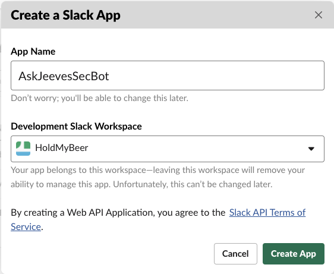
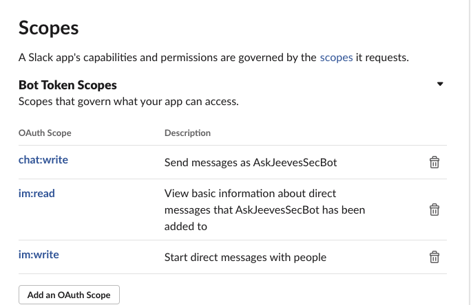
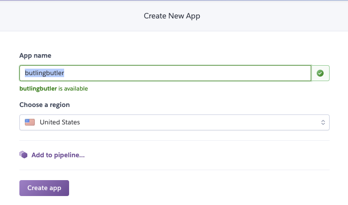

# Install/Setup AskJeevesSecBot

## Init config files
1. `git clone https://github.com/CptOfEvilMinions/AskJeevesSecBot`
1. `cd AskJeevesSecBot`
1. `mv AskJeeves/config/config.yaml.example AskJeeves/config/config.yaml`
1. `mv ButlingButler/config/config.py.example ButlingButler/config/config.py`

## Create MaxMind license key for GeoIP database
1. Go to [GeoIP](https://www.maxmind.com/en/geoip-demo) and login
1. Select "My License Key" on the left under "Services"
1. Select "Generate new license key"
1. Enter `AskJeevesSecBot` into "License key description"
1. Select "No" for if this will be used GeoIP update
1. Select "Confirm"
1. Copy "License key"
1. `sed -i 's/max_mind_license_key_here/<LICENSE KEY>/g' AskJeeves/config/config.yaml`

## Create and configure Slack app
### Create app
1. Login into Slack with administrator account
1. Select "Your Apps" in the top right
1. Select "Create New App"
    1. Enter `AskJeevesSecBot` into "App Name"
    1. Select `<YOUR SLACK workspace>`
    1. Select "Create app"
    1. 

### Add permissions
1. Select "Permissions" under "Add features and functionality"
1. Add the following permissions to "Scopes"
    * `chat:write`
    * `im:read`
    * `im:write`
    1. 
1. Scroll up to the top and select "Install app to Workspace"
1. Select "Allow"
1. Copy "Bot User OAuth Access Token"
1. `sed -i s'/slack_token_here/<SLACK TOKEN>/g' AskJeeves/config/config.yaml`

### Set Redirect URL
1. Select "Add New Redirect URL"
1. Enter URL for Heroku app
1. Select "Save URLs"
1. <ENTER IMAGE>

## Get Google API key for Google Maps
1. Login into Google account as an administrator
1. Open a browser to [Get Google project API key](https://developers.google.com/maps/gmp-get-started)
1. Select "Get Started"
1. Select "APIs and Services" on the left
1. Select "Credentials" on the left
1. Select "+ Create Credentials"
    1. Copy `Your API key`
1. `sed -i 's/google_maps_api_key_here/<Google Maps API key>/g' ButlingButler/config/config.py`
1. Select "Restrict key"
1. Select "+ Enable APIs and Services"
1. Select "Maps Static API"
1. Select "Enable"
1. Select `<API key from above>` for `All API credentials`

## Create theHive token
1. Login into theHive as an administrator
1. Select "Organisation" in the top right
1. Select "+ Create new user"
1. Enter `askjeevessecbox@<domain>` into "login"
1. Enter `<NAME>` into "Full name"
1. Select `analyst` for "profile"
1. Select "Save user"
1. <ENTER IMAGE>
1. Select "Reveal" under "API key"
1. Copy API key
1. `sed -i s'/the_hive_key_here/<THEHIVE API KEY>/g' AskJeeves/config/config.yaml`

## Set MySQL password for AskJeeves
1. `sed -i s'/mysql_password_here/<MySQL password>/g' AskJeeves/config/config.yaml`
1. `sed -i s'/MYSQL_ROOT_PASSWORD: "toor"/MYSQL_ROOT_PASSWORD: "<MySQL password>"/g' docker-compose.yml`

## Set MySQL password for ButlingButler 
1. 

## Create Heroku app
### Create app
1. Login into Heroku
1. Select "Create new app"
1. Enter `butlingbutler` for "App name"
1. Select "<REGION>"
1. Select "Create app"
1. 
1. 

### Connect to Heroku on macOS
1. `brew tap heroku/brew && brew install heroku`
1. `heroku login`
1. `heroku container:login`

## Configure and spin-up AskJeeves
### Docker setup
1. `cd AskJeevesSecBot/`
1. `vim docker-compose.yml`
1. Under `MySQL` service set `MYSQL_ROOT_PASSWORD`, `MYSQL_PASSWORD`

## AskJeeves config
1. `cd AskJeevesSecBot/AskJeeves`
1. `cp config/config.yaml.example cp config/config.yaml`
1. `vim cp config/config.yaml` and set:
  1. Under `Slack` set `token` to the Slack token from above
  1. Under `MySQL` set `username`, `password`, and `expire`

## Spin up ButlingButler
1. `cd ButlingButler/`
1. `docker-compose build`
1. `docker-compose up -d`

## Spin up AskJeeves
1. `docker-compose build`
1. `docker-compose up -d`

### Test setup
1. `docker run -it --net askjeevessecbot_logging-backend ubuntu:18.04 bash`
1. `logger -n 10.150.100.210 -P 1514 --rfc3164 -t 'openvpn' "128.101.101.101:56555 [testuser] Peer Connection Initiated with [AF_INET]128.101.101.101:56555"`

##  References